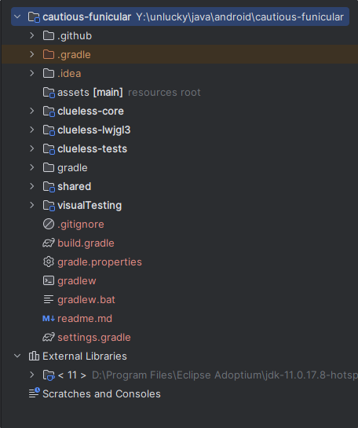
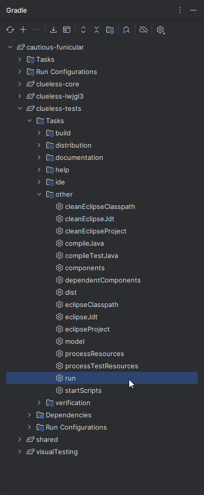
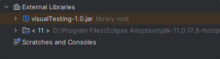
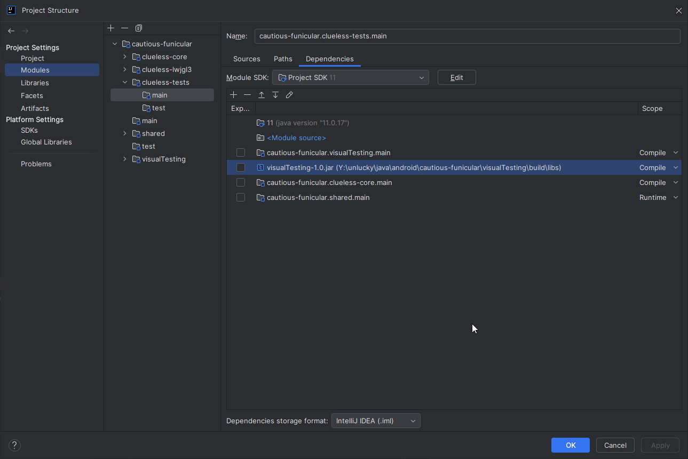
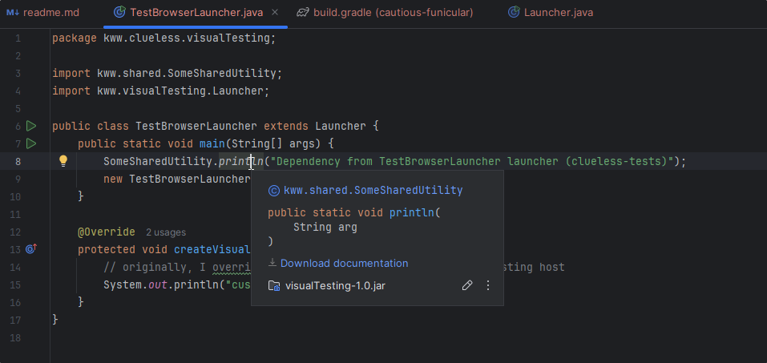
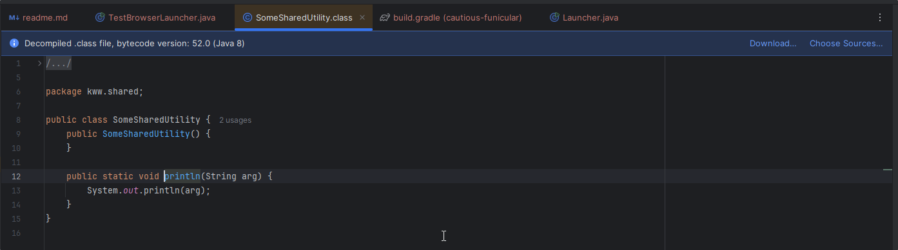
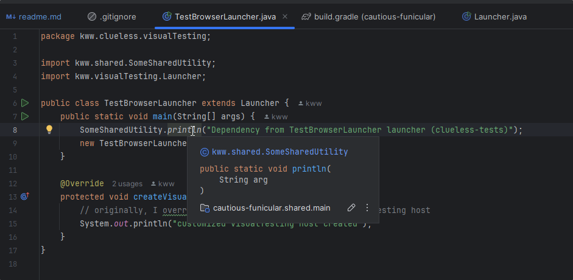

## steps to reproduce
1. Get latest version of IntelliJ IDEA (newer than `2023.2.8.win`)
2. Import this project
3. You will see something like this: \
(notice the `External Libraries` contains only JDK)

4. Execute the `run` task of subproject `clueless-tests` \

5. Now you will notice the `visualTesting-1.0.jar` popped up as an external library \

6. This leads to `shared` module being "invisible" so the tooltip and `go to declaration` points me to the method in JAR instead of pointing to the source code \

7. When we don't have that JAR in `External Libraries` (e.g. after `clean` task), the tooltip shows the method comes from `shared` module

## what's else
Doing the same steps in IntelliJ IDEA `2023.2.8.win` or older does not produce this result.
There is no artificial external JAR library so the tooltip as well as `go to declaration` points me to source code instead of the same method in JAR

